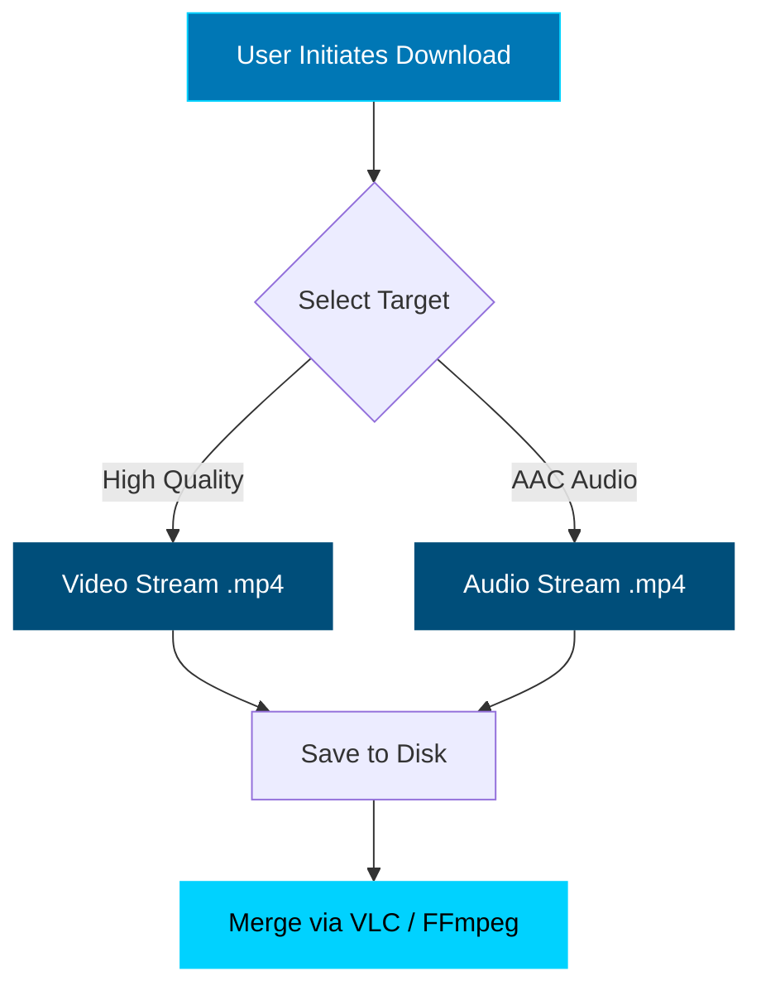

 

 

 

> **"Experience the stream as it was meant to be seen."**
>   A sophisticated userscript that injects a high-performance HLS player into restricted Vimeo & Patreon embeds.

---

## 💠 Core Architecture

VimeoSPL v4.0 is rebuilt from the ground up to prioritize **stability** and **aesthetics**.

| Component | Status | Description |
| :--- | :---: | :--- |
| **Visual Core** | 🎨 | **Glassmorphism UI**: Blur backdrops (`backdrop-filter`), smooth fade transitions, and a deep blue dark mode. |
| **Access Node** | 🔓 | **Header Injection**: Bypasses privacy settings by emulating valid referrer headers. |
| **Download Engine** | 🚀 | **Separate Streams**: Downloads Raw Video (`.mp4`) and Audio (`.mp4`) independently for 100% success rate. |
| **Input System** | ⌨️ | **Keyboard Driven**: Full hotkey support for power users (Seek, Volume, Fullscreen). |

---

## ⚡ Installation Protocol

### 1. Initialize Environment
You need a userscript manager to inject the core.

| Browser | Recommended Agent |
| :--- | :--- |
| **Chrome / Brave** | [Violentmonkey](https://chromewebstore.google.com/detail/violentmonkey/jinjaccalgkegednnccohejagnlnfdag) |
| **Firefox** | [Violentmonkey](https://addons.mozilla.org/en-US/firefox/addon/violentmonkey/) |

### 2. Deploy Script
Click the terminal button below to install directly.

   
  
    

---

## 🎮 Interface & Controls

The UI is designed to disappear when you don't need it and provide granular control when you do.

| Command | Key / Action |
| :--- | :--- |
| **Playback** | <kbd>Space</kbd> or Click Center |
| **Fullscreen** | <kbd>F</kbd> |
| **Seek** | <kbd>←</kbd> / <kbd>→</kbd> (5s increments) |
| **Volume** | <kbd>↑</kbd> / <kbd>↓</kbd> or Hover Slider |
| **Download** | Click <kbd>⬇</kbd> Icon in Bar |

---

## 📥 Stream Extraction Logic

To ensure maximum quality and zero corruption, we do not mux in the browser.

> **Note:** Browser-based merging is unstable for large 4K files. Downloading streams separately guarantees you get the raw data directly from the CDN.

---

## 🛡️ Disclaimer

> This tool is engineered for **educational purposes** and personal archiving of content you legally access. The code interacts with Vimeo's player API and HLS manifests.

  

