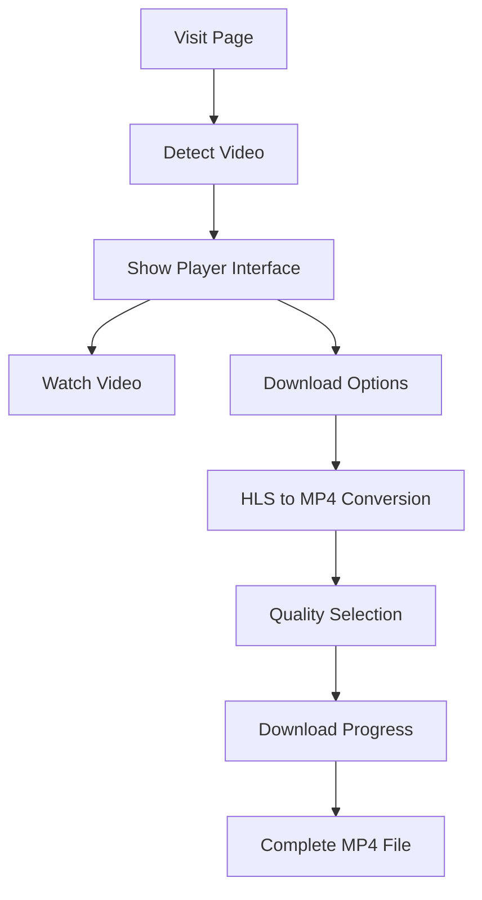

# SPL (SimplePatreonLoader) 🎥
[](https://github.com/5f32797a/VimeoSPL/issues)
[](https://github.com/5f32797a/VimeoSPL/blob/main/LICENSE)
[](https://github.com/5f32797a/VimeoSPL/commits/main)
[](https://github.com/5f32797a/VimeoSPL/blob/main/main.js)

> An enhanced userscript for loading and downloading Vimeo videos with Patreon referrer.

## 🚀 Features

- **Video Access**: Automatically bypasses restrictions on Vimeo videos
- **Direct Downloads**: Convert and download HLS streams to MP4 files directly in browser
- **Quality Options**: Choose from available video qualities (up to 1440p/4K when available)
- **HLS Streaming**: Support for HLS streaming and conversion
- **Progress Tracking**: Real-time download progress with segment counting
- **Clean Interface**: Dark theme with modern UI elements
- **Zero Dependencies**: No additional extensions or software required

## 📋 Prerequisites

### Required:
- 🌐 Modern web browser (Chrome, Firefox, Edge, Brave, etc.)
- 📌 A userscript manager:
  
  | Manager | Status | Recommendation |
  |---------|--------|----------------|
  | [Violentmonkey](https://violentmonkey.github.io/) | ✅ Recommended | Best compatibility across all browsers |
  | [Tampermonkey](https://www.tampermonkey.net/) | ✅ Supported | Popular alternative |
  | Greasemonkey | ❌ Not Recommended | Known compatibility issues |

## 💻 Installation

### 1️⃣ Install a Userscript Manager

#### Recommended: Violentmonkey
- 🎯 **Chrome/Edge/Brave**: [Chrome Web Store](https://chromewebstore.google.com/detail/violentmonkey/jinjaccalgkegednnccohejagnlnfdag)
- 🦊 **Firefox**: [Firefox Add-ons](https://addons.mozilla.org/en-US/firefox/addon/violentmonkey/)
- 🌐 **Other Browsers**: [Official Website](https://violentmonkey.github.io/)

#### Alternative: Tampermonkey
- 🔧 Visit [Tampermonkey's Website](https://www.tampermonkey.net/)

### 2️⃣ Install the Script

1. Click "Create a new script" in your userscript manager
2. Copy the entire script from [main.js](https://github.com/5f32797a/VimeoSPL/blob/main/main.js)
3. Save (Ctrl+S or Cmd+S)
4. Enable the script in your manager's dashboard

## 🎮 Usage

### Loading Videos
1. Navigate to any restricted Vimeo video page
2. The script automatically detects and loads the video

### Downloading Videos
1. Click the **Download** button in the player interface
2. Choose from the available options:
   - **Download HLS as MP4** (converts HLS stream to downloadable MP4)
   - **Select quality** options for higher resolution videos
   - **Save HLS Stream** for use with external players



## 🔄 What's New in v2.2

- **Streamlined Interface**: Focus on HLS to MP4 conversion
- **Removed Direct MP4**: Simplified code by focusing on HLS processing
- **Quality Selection Dialog**: Choose from multiple video qualities
- **Progress Tracking**: Real-time download progress with segment tracking
- **Improved UI**: Clean, modern interface with better feedback
- **Error Handling**: Better recovery from network issues
- **Performance**: Optimized downloading of large video files

## 🔧 Compatibility

### Tested Browsers
- ✅ Google Chrome
- ✅ Mozilla Firefox
- ✅ Microsoft Edge
- ✅ Brave Browser
- ✅ Kiwi Browser (Android)

## ⚠️ Disclaimer

```
This script is provided "as is" without warranty of any kind. While we strive to maintain
compatibility with Vimeo's platform, updates may be required as their platform evolves.
```

## 🤝 Contributing

We welcome contributions! Please feel free to:
- Submit Pull Requests
- Report Bugs
- Suggest Enhancements
- Share Feedback

## 💬 Support

Need help?
1. 📚 Check our [GitHub Issues](https://github.com/5f32797a/VimeoSPL/issues)
2. 🆕 Create a new issue if needed
3. 💡 Include as much detail as possible in your reports

---

<div align="center">
  
**SPL - Vimeo Video Loader & Downloader**

[⭐ Star this repo](https://github.com/5f32797a/VimeoSPL) | [📝 Report Bug](https://github.com/5f32797a/VimeoSPL/issues)

</div>
