# SPL (SimplePatreonLoader) - Optimized 🚀

> An enhanced and optimized userscript for loading and downloading restricted Vimeo videos. This version features a complete architectural rewrite for superior performance, reliability, and a modern user experience.

## ✨ Key Features

-   **Robust Video Access**: Employs multiple extraction methods to reliably access video data, bypassing privacy and referrer-based restrictions.
-   **Modern Player Interface**: Replaces the standard restricted page with a clean, dark-themed player shell, complete with essential controls.
-   **Advanced HLS Downloader**:
    -   Downloads and combines HLS stream segments into a single MP4 or M4A file.
    -   Utilizes concurrent downloads to maximize speed.
    -   Shows real-time progress with notifications.
-   **Direct MP4 Downloads**: When available, provides direct download links for MP4 files that include both video and audio.
-   **Interactive Quality Selection**:
    -   Lets you choose from all available video resolutions (e.g., 1080p, 1440p, 4K).
    -   Clearly indicates which streams contain audio (`✓ Audio` vs. `✗ No Audio`).
    -   Lists separate audio-only tracks for individual download.
-   **Helpful Utilities**:
    -   **Save HLS Stream**: Save a `.m3u8` playlist file for use in external players like VLC.
    -   **Copy Stream URL**: Quickly copy the master playlist URL to your clipboard.
-   **Rich Notifications**: Get real-time feedback on download progress, completions, and errors.
-   **High Performance & Reliability**: Built with retry logic, timeouts, and optimized code for handling large files and flaky connections.
-   **Zero Dependencies**: Works out-of-the-box with just a userscript manager.

## 📋 Prerequisites

You'll need a modern web browser and a userscript manager.

| Manager                                                   | Status            | Recommendation                               |
| --------------------------------------------------------- | ----------------- | -------------------------------------------- |
| [Violentmonkey](https://violentmonkey.github.io/)         | ✅ **Recommended**  | Excellent compatibility across all browsers. |
| [Tampermonkey](https://www.tampermonkey.net/)             | ✅ Supported      | A popular and solid alternative.             |
| Greasemonkey                                              | ❌ Not Recommended | May have compatibility issues.               |

## 💻 Installation

1.  **Install a Userscript Manager** (if you don't have one):
    -   **Chrome/Edge/Brave**: [Violentmonkey](https://chromewebstore.google.com/detail/violentmonkey/jinjaccalgkegednnccohejagnlnfdag) or [Tampermonkey](https://chrome.google.com/webstore/detail/tampermonkey/dhdgffkkebhmkfjojejmpbldmpobfkfo)
    -   **Firefox**: [Violentmonkey](https://addons.mozilla.org/en-US/firefox/addon/violentmonkey/) or [Tampermonkey](https://addons.mozilla.org/en-US/firefox/addon/tampermonkey/)

2.  **Install the Script**:
    -   Click the link below to install directly:
          
        ➡️ **[Install SPL v3.0](https://raw.githubusercontent.com/5f32797a/VimeoSPL/main/spl-vimeo-loader.js)**
          
    -   Your userscript manager will open a new tab. Simply click **"Install"** or **"Confirm Installation"**.

3.  **You're ready!** The script is now active.

## 🎮 How to Use

The script works automatically.

1.  **Load a Video**: Navigate to any restricted Vimeo video URL. The script will take over the page, bypass restrictions, and load a custom player interface.

2.  **Download a Video**:
    -   In the player controls at the top, click the **`⬇ Download`** button.
    -   A dropdown menu will appear with several options:
        -   **`🎬 Download Video (HLS)`**: This is the most powerful option. It opens a dialog where you can select from all available video and audio qualities.
        -   **`📹 Direct MP4 Downloads`**: If available, this opens a simpler dialog to download a complete MP4 file directly.
        -   **`📄 Save HLS Stream`**: Saves a `.m3u8` file. Open this with a media player like VLC to stream the video directly.
        -   **`📋 Copy Stream URL`**: Copies the HLS stream URL to your clipboard.

3.  **Track Progress**: A notification will appear in the bottom-right corner, showing you the real-time download progress, speed, and final status.

### User Flow Diagram

```mermaid
graph TD
    subgraph "Loading"
        A[Navigate to Restricted Vimeo Page] --> B{Script Auto-Runs};
        B --> C[Replaces Page with Custom Player UI];
    end

    subgraph "Interaction"
        C --> D{Click '⬇ Download'};
        D --> E[Dropdown Menu Appears];
    end

    subgraph "Download Paths"
        E --> F["🎬 Download Video (HLS)"];
        E --> G["📹 Direct MP4 Downloads"];
        E --> H["📄 Save HLS Stream (.m3u8)"];
        E --> I["📋 Copy Stream URL"];
    end

    subgraph "HLS Path"
        F --> J[Quality Selection Dialog];
        J --> K{Choose Video Quality};
        J --> L{Choose Audio-Only Track};
        K --> M[Downloads & Combines Segments];
        L --> M;
    end

    subgraph "MP4 Path"
        G --> N[MP4 Quality Dialog];
        N --> O{Choose MP4 Quality};
        O --> P[Directly Downloads Single MP4 File];
    end

    subgraph "Completion"
        M --> Q[Save as .mp4/.m4a File];
        P --> Q;
        Q --> R["✅ Download Complete!"];
    end

    style C fill:#2c3e50,stroke:#3498db,stroke-width:2px,color:#fff
    style D fill:#3498db,stroke:#2980b9,stroke-width:2px,color:#fff
    style R fill:#27ae60,stroke:#2ecc71,stroke-width:2px,color:#fff
```

## 🔄 What's New in v3.0

Version 3.0 is a ground-up rewrite, introducing major improvements across the board.

-   **New Architecture**: Re-engineered with modern JavaScript classes (`UIManager`, `HLSManager`, `VideoExtractor`) for better maintainability and performance.
-   **Revamped UI/UX**: A polished, intuitive, and fully custom user interface that replaces the entire Vimeo page.
-   **Enhanced Downloader**: The HLS downloader is now more robust, faster with concurrent segment fetching, and provides clear progress.
-   **Direct MP4 Downloads Re-introduced**: The ability to download single-file MP4s is back and better than ever.
-   **Audio-Aware Quality Selection**: The new quality dialog intelligently informs you if a video stream includes audio, solving a common point of confusion.
-   **Separate Audio Tracks**: Easily download just the audio from a video.
-   **Advanced Error Handling**: The script is more resilient to network errors and platform changes, with built-in retry logic.
-   **Optimized Performance**: From initial load to final download, every step has been optimized for speed and efficiency.

## 🔧 Browser Compatibility

The script has been tested and confirmed to work on the latest versions of the following browsers:

-   ✅ Google Chrome
-   ✅ Mozilla Firefox
-   ✅ Microsoft Edge
-   ✅ Brave Browser
-   ✅ Kiwi Browser (Android)

## ⚠️ Disclaimer

This script is provided for personal and educational use only. It is offered "as is" without any warranty. The functionality depends on Vimeo's current platform structure, which may change at any time. Please respect the copyright and privacy settings of content creators.

## 🤝 Contributing & Support

Your feedback and contributions are welcome!

-   **Report a Bug**: If you find an issue, please [create a new issue](https://github.com/5f32797a/VimeoSPL/issues) with as much detail as possible (video URL, browser version, etc.).
-   **Suggest an Enhancement**: Have an idea for a new feature? Let us know!
-   **Submit a Pull Request**: Code contributions are highly appreciated.

---

  
**SPL - The Ultimate Vimeo Video Loader & Downloader**

[⭐ Star this Repo](https://github.com/5f32797a/VimeoSPL) | [📝 Report a Bug](https://github.com/5f32797a/VimeoSPL/issues)

